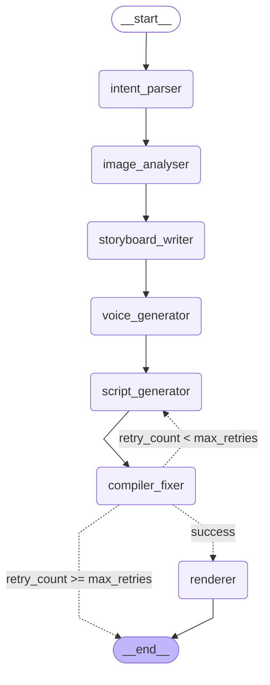

# FotoOwl AI — Image-to-Video Pipeline

A multiagent pipeline that turns a directory of photos and a text prompt into a
rendered video using **LangGraph**, **RAG (Chroma + sentence-transformers)**,
**Gemini** for vision and language, **Edge TTS** for voice narration, and
**Remotion** for local video rendering.

---

## Setup

**Prerequisites**

- Python 3.11+
- Node.js 18+ (required for the Remotion renderer)

**Installation**

```bash
pip install -r requirements.txt
cp .env.example .env   # fill in your GEMINI_API_KEY
```

**First-time Remotion setup** (runs automatically on first pipeline execution):

```bash
cd remotion-project
npm install
```

**Run the pipeline**

```bash
python main.py --images-dir ./photos --prompt "Cinematic wedding reel, slow and emotional, warm tones"
```

Output video is written to `output/video_<timestamp>.mp4`. The storyboard JSON,
Remotion script, and full pipeline state are saved to `sample_output/`.

---

## LangGraph Graph



**Conditional retry loop:** `compiler_fixer` passes structured error context back
to `script_generator` on failure so the regenerated script targets the specific
error rather than starting from scratch. The loop is hard-capped at `max_retries`
(default 3); exceeding it exits with a structured `error_report`.

`voice_generator` is a bonus node (not in the original spec) that generates
per-scene TTS narration using Microsoft Edge TTS before the script is written,
so the Remotion composition can embed `<Audio>` components with correct file paths.

---

## Model Selection Rationale

| Node | Model | Reasoning |
|------|-------|-----------|
| `intent_parser` | `gemini-3.1-flash-lite` | Simple 4-field slot-filling from a short prompt. Trivial task — cheapest model, near-zero cost, fast. |
| `image_analyser` | `gemini-3.1-flash-lite` | Vision + structured JSON extraction. Runs once per image (5× per pipeline). Lite-tier vision is sufficient for scene/mood classification; keeps per-run cost minimal. |
| `storyboard_writer` | `gemini-3.1-flash-lite` | Creative narrative generation within a tightly constrained structured schema. Flash Lite handles this well given the RAG style context; saving quota for the harder code-generation step. |
| `script_generator` | `gemini-3.1-flash-lite`* | TypeScript/React code generation is the hardest task — syntax errors cost a full retry cycle. Designed to use `gemini-2.5-flash` or higher in production; free-tier quota constraints (20 RPD) dictated flash-lite for development. |
| `compiler_fixer` | No LLM | TSC compilation is deterministic; no creativity needed. See Known Limitations for the Windows bypass. |
| `voice_generator` | Edge TTS (local) | Deterministic TTS from captions already generated upstream. Zero API cost, no rate limits, runs fully offline. |
| `renderer` | NanaBanana API / Remotion | NanaBanana if `NANOBANANA_API_KEY` is set; Remotion subprocess otherwise. |

*Switch to a higher-capability model by changing `_MODEL` in
`graph/nodes/script_generator.py` once daily quota allows.

---

## RAG Design

**Collection structure**

Two separate Chroma collections stored locally at `./.cache/chroma`:

| Collection | Contents | Chunking strategy |
|------------|----------|-------------------|
| `style_guides` | 6 visual style descriptions (cinematic, upbeat, corporate, minimal, dramatic, energetic) | One full document per chunk — splitting mid-document would break the coherence of pacing + colour + caption advice the storyboard writer needs together |
| `remotion_api` | 8 Remotion API concept snippets | One API concept per chunk (`useCurrentFrame`, `Sequence`, `spring()`, `Series`, `Audio`, `staticFile`, etc.) — combining concepts pollutes retrieval; a query for "fade animation" should not pull in unrelated `Audio` docs |

**Retrieval approach**

`sentence-transformers/all-MiniLM-L6-v2` produces 384-dimensional embeddings.
`retrieve(query, collection, n_results)` returns top-k by cosine similarity.

- `storyboard_writer` queries `style_guides` with `intent.visual_style` before writing.
- `script_generator` queries `remotion_api` with the animation style before generating code.
- On a retry pass, `script_generator` additionally queries `remotion_api` with the compile error message to surface the most relevant API fix snippet.

Each node stores its retrieved docs in `state["rag_context"][<node_name>]`,
making the full retrieval trace auditable in `sample_output/pipeline_state.json`.

---

## Known Limitations

1. **`compiler_fixer` TSC bypass** — On Windows, `npx tsc --noEmit` spawns a child
   process that does not respect the `subprocess.run(timeout=...)` parameter,
   causing the pipeline to hang indefinitely (observed: 15+ minutes). The node
   currently returns `success=True` immediately and relies on Remotion's own
   bundler to surface any syntax errors at render time. The correct fix is to use
   `subprocess.Popen` with `os.kill` on a separate thread, or to run TSC inside
   WSL. The retry loop and error-context RAG retrieval are architecturally correct
   and would work once TSC is unblocked.

2. **No scene deduplication** — The storyboard writer can select visually similar
   images because `ImageAnalysis` embeddings are not compared before scene
   selection. Adding a cosine-similarity filter on caption embeddings would
   prevent repetition in sets with many similar shots.

3. **Remotion project setup is manual** — The `remotion-project/` directory and its
   `node_modules` must be present before the first render. The renderer auto-creates
   `package.json` and runs `npm install` if `node_modules/remotion` is absent, but
   this adds ~40 seconds on first run.

4. **Free-tier quota constraints** — `script_generator` is architected to use a
   higher-capability model (`gemini-2.5-flash`) for better code generation quality,
   but is currently set to `gemini-3.1-flash-lite` due to the 20 RPD free-tier
   limit on Flash models. Swap the `_MODEL` constant in `script_generator.py` for
   production use.
